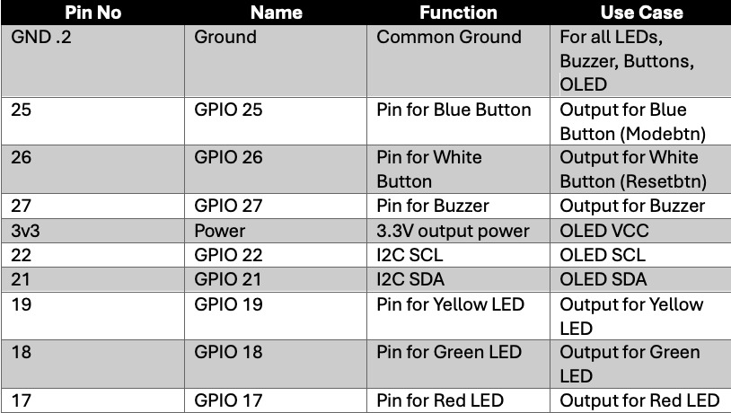

## 📂 Project Structure
```
Task-A/
├── .pio/ 
├── .vscode/ 
├── include/ 
│ └── README.md -> (includes pinmap, wokwi link, screenshots)
├── lib/ 
├── screenshots/ 
│ └── PinMap.png
├── src/ 
│ └── main.cpp
├── test/ 
├── wokwi/ 
│ └── diagram.json
├── platformio.ini 
└── wokwi.toml
```
--- 

## 🔗 Wokwi Link
<div>
    <p>Assignment 1 Task A project link: 
        <a target="_blank" href="https://wokwi.com/projects/444997908922052609">
            <u> https://wokwi.com/projects/444997908922052609
            </u>
        </a>
    </p>
</div>

--- 

## Pin Map Table
<div>
    
</div>

--- 

## ScreenShots

---
