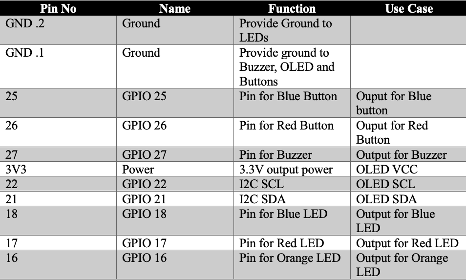

## 📂 Task-B Project Structure
```
Task-B/
├── .pio/ 
├── .vscode/ 
├── docs/ 
├── include/ 
│ └── README.md -> (includes pinmap, wokwi link, screenshots)
├── lib/ 
├── screenshots/ -> (includes all screenshots and PinMap.png)
├── src/ 
├── test/ 
├── wokwi/ 
├── diagram.json 
├── platformio.ini 
├── Short Clip.mp4 -> (Short clip of hardware working)
└── wokwi.toml
```
--- 

## 🔗 Wokwi Link
<div>
    <p>Assignment 1 Task B project link: 
        <a target="_blank" href="https://wokwi.com/projects/445165207310341121"> https://wokwi.com/projects/445165207310341121
        </a>
    </p>
</div>

--- 

## 📍 Pin Map Table
<div>
    
</div>

--- 

## 📸 ScreenShots
<div>
    <h3>1. Build Output</h3>
    
    <h3>2. Upload Output</h3>
    
    <h3>3. Short Press LED OFF Picture</h3>
    
    <h3>4. Short Press LED ON Picture</h3>
    
    <h3>5. Long Press Picture</h3>
    
</div>

---

## Short Clip
<div>
    <video width="600" controls>
    <source src="../Short Clip.mp4" type="video/mp4" alt="Short Clip" width="650px" height="400px">
    Your browser does not support the video tag.
    </video>
</div>
 
 ---